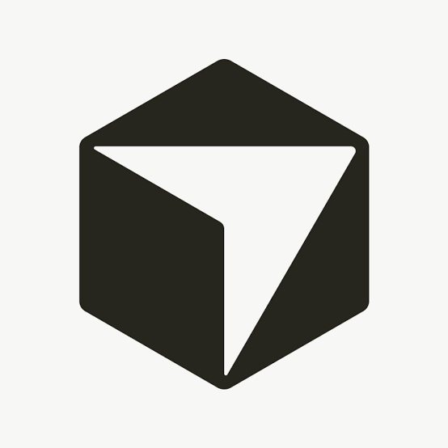
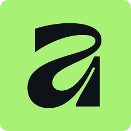

# 👋 Olá, eu sou Bruno Feola Rossetti

### 💻 Desenvolvedor Full Stack

Apaixonado por tecnologia e desenvolvimento. 
Gosto de transformar ideias em soluções reais, escrevendo código 
limpo, escalável e eficiente.

📧 <a href="mailto:rossetti.profissional@gmail.com">rossetti.profissional@gmail.com</a>
&nbsp;&nbsp;•&nbsp;&nbsp;
🇧🇷 Brasil
&nbsp;&nbsp;•&nbsp;&nbsp;
<a href="https://www.linkedin.com/in/bruno-feola-rossetti-0b9979428">LinkedIn</a>

 

---

# 🛠️ Tecnologias

<table>
<tr>

<td align="center" width="90">
 
<b>HTML</b>
</td>

<td align="center" width="90">
 
<b>CSS</b>
</td>

<td align="center" width="90">
 
<b>JavaScript</b>
</td>

<td align="center" width="90">
 
<b>React</b>
</td>

<td align="center" width="90">
 
<b>PostgreSQL</b>
</td>

<td align="center" width="90">
 
<b>Node.js</b>
</td>

<td align="center" width="90">
 
<b>Docker</b>
</td>

</tr>

<tr>

<td align="center">
 
<b>Git</b>
</td>

<td align="center">
 
<b>GitHub</b>
</td>

<td align="center">
 
<b>Cursor</b>
</td>

<td align="center">
 
<b>VS Code</b>
</td>

<td align="center">
 
<b>Figma</b>
</td>

<td align="center">
 
<b>Affinity</b>
</td>

</tr>
</table>

---

# 📊 GitHub Stats

<table>
<tr>

<td width="50%" valign="top">

### 📈 Estatísticas Gerais

</td>

<td width="50%" valign="top">

### 🍩 Linguagens Mais Usadas

</td>

</tr>
</table>

---

# 📈 Resumo de Atividades

---

# 🚀 Projetos em Destaque

<table>
<tr>

<td width="33%" valign="top">

### 💻 Portfólio

Meu portfólio pessoal desenvolvido para apresentar minha trajetória, habilidades, tecnologias e projetos.

O projeto possui uma interface moderna, responsiva e focada em experiência do usuário, utilizando animações e interações desenvolvidas com JavaScript e jQuery.

 

**Tecnologias**

  

🔗 **Em desenvolvimento**

</td>

<td width="33%" valign="top">

### ⚙️ Projeto 02

**Em breve...**

Novo projeto sendo desenvolvido.

Acompanhe o GitHub para conferir as próximas aplicações e experimentos.

 

**Tecnologias**

`Em breve`

  

🔗 **Em breve**

</td>

<td width="33%" valign="top">

### 🚀 Projeto 03

**Em breve...**

Projeto futuro voltado para desenvolvimento web e criação de soluções digitais.

 

**Tecnologias**

`Em breve`

  

🔗 **Em breve**

</td>

</tr>
</table>

---

# 🧠 Atualmente estudando

  

`React`   `Node.js`   `PostgreSQL`   `Docker`   

 

* ⚛️ Desenvolvimento de aplicações modernas com React
* 🟢 Desenvolvimento de APIs e aplicações backend com Node.js
* 🐘 Banco de dados e PostgreSQL
* 🐳 Docker e ambientes de desenvolvimento
* 🎨 UI/UX e prototipação
* 🏗️ Arquitetura e boas práticas de software

---

# 🌐 Vamos nos conectar!

<table>
<tr>

<td align="center" width="33%">

### 📧

**Email**

<a href="mailto:rossetti.profissional@gmail.com">
rossetti.profissional@gmail.com
</a>

</td>

<td align="center" width="33%">

### 💼

**LinkedIn**

<a href="https://www.linkedin.com/in/bruno-feola-rossetti-0b9979428">
bruno-feola-rossetti
</a>

</td>

<td align="center" width="33%">

### 🐙

**GitHub**

<a href="https://github.com/rossetticoder">
rossetticoder
</a>

</td>

</tr>
</table>

---

## 💡 Transformando ideias em código.

 

⭐ Se algum dos meus projetos te ajudar, considere deixar uma estrela!

  

